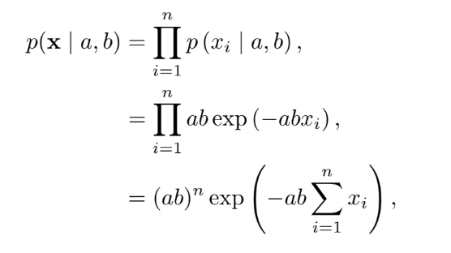
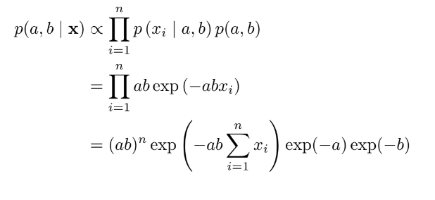
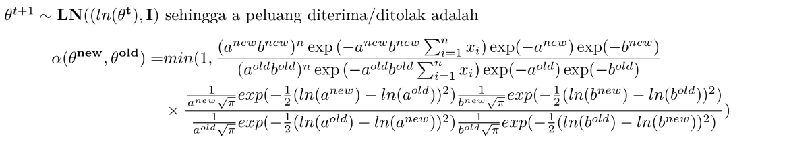
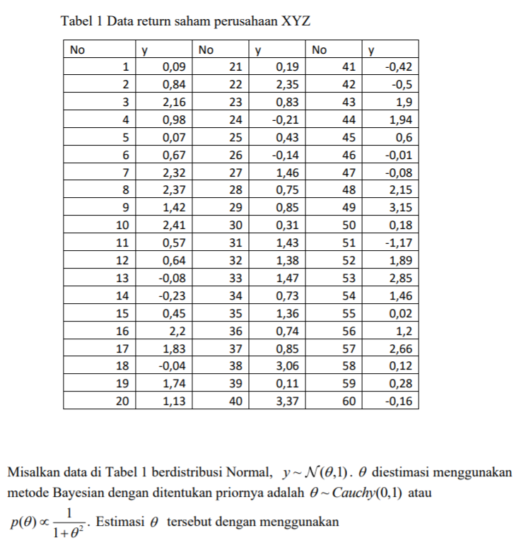
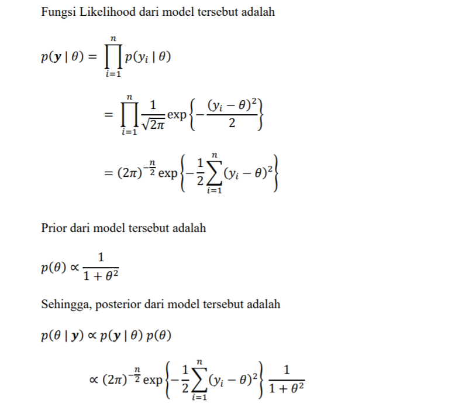
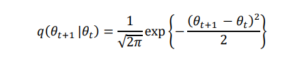

<style>
body {
text-align: justify}
</style>
```{r setup, include=FALSE}
knitr::opts_chunk$set(message = FALSE)
knitr::opts_chunk$set(warning = FALSE)
```

**Catatan : Kodingan ini untuk memenuhi tugas simdat, kemungkinan banyak kesalahan. Mohon dimaklumi**  
# Metropolis Hasting

## Contoh Metropolis Hasting (1)

Misalkan fungsi:  
\begin{align*}
f(y) = c & exp(-y^4)(1+|y|)^3 \\
& {-\infty}<y<\infty
\end{align*}
dengan $c$ adalah *normalizing constant*

Densitas proposal $q(x,y)=q(y|x)$ dan memutuskan apakah menerima atau tidak proposal ini dengan peluang $\alpha(x,t)$. Unutuk proposal ini, dipilih densitas yang mendekati $f(y)$ dan mudah disimulasikan. Di sini kita gunakan distribusi normal dengan rata-rata sama dengan nilai sebelumnya diterima value, $x$, dan varians 1. Peluang diterimanya adalah:

\begin{align*}
\alpha(x,y) & = min\{1,\frac{f(y)q(y,x)}{f(x)q(x,y)}\} \\

& = min\{1,\frac{c exp(-y^4)(1+|y|)^3(2\pi)^{-1/2}exp(-(y-x)^2/2)}{c exp(-x^4)(1+|x|)^3(2\pi)^{-1/2}exp(-(x-y)^2/2)}\} \\

& = min\{1,\frac{exp(-y^4+x^4)(1+|y|)^3}{(1+|x|)^3}\}

\end{align*}

Untuk inisial, tentukan sembarang nilai $X_i$. Kemudian algoritma MH untuk mendapatkan $X_{n+1}$ adalah:  
1. Bangkitkan $y$ dari $normal(X_n,1)$  
2. Hitung $\alpha(X_n,y)$  
3. Dengan peluang $\alpha(X_n,y)$, tentukan $X_{n+1} = y$ (Nilai yang diterima). Lainnya, dengan peluang $1-\alpha(X_n,y)$, tentukan $X_{n+1}=X_n$ (Simpan dari nilai iterasi berikutnya).

R code:

```{r}
library(ggplot2)
alphafun = function(x, y) {
  exp(-y^4 + x^4)*(1+abs(y))^3*(1+abs(x))^{-3}
}
mh_mcmc = function(alphafn, burnin, N, thin) {
  x = numeric(burnin + N*thin)
  x[1] = rnorm(1)
  for (i in 2:(burnin + N*thin)) {
    propy = rnorm(1, x[i - 1], 1)
    alpha = min(1, alphafn(x[i-1], propy))
    x[i] = ifelse(rbinom(1, 1, alpha), propy, x[i-1])
  }
  return(x[burnin + (1:N)*thin])
}
sample = mh_mcmc(alphafun, 5000, 10000, 10)
f_true = function(x) {
  exp(-x^4)*(1+abs(x))^3
}
integral = integrate(f_true, 0, Inf)
c = 2 * integral$value
f_true = function(x) {
  exp(-x^4)*(1+abs(x))^3 / c
}
f_true_plot.dat = data.frame(x = seq(-2, 2, length = 100),
                             y = f_true(seq(-2, 2, length = 100)))
ggplot(f_true_plot.dat, aes(x, y)) +
  geom_line(color = "blue", size = 1.2) + ylab("pdf") +
  geom_histogram(data = data.frame(x = sample), aes(x = x, y = ..density..),
                 color = "gray")
```


## Contoh Metropolis Hasting (2)

Gunakan algoritma Metropolis-Hasting untuk membangkitkan bilangan acak dengan fungsi:

\begin{align*}
f(x)=\frac{1}{Z}
    \begin{cases}
    \frac{sin(x)^2}{x^2} \ , jika x \in [-3\pi,3\pi] \\
    0 \ \ \ , lainnya
    \end{cases}
\end{align*}
dengan proposal $Y_j ~ N(X_j, \sigma^2)$ untuk $\sigma=1,6,36$.

Jawab:
Pertama dicari dulu Peluang terima/tolaknya terlebih dahulu

\begin{align*}
q(y|x) & = \frac{1}{\sqrt{2\pi\sigma^2} exp(\frac{-(y-x)^2}{2\sigma^2})}\\
\\

\alpha(x,y) & = min\{1,\frac{f(y)q(y,x)}{f(x)q(x,y)}\} \\
\\
& = min\{1,\frac{1/Z \frac{(sin \ y)^2}{y^2} \frac{1}{\sqrt{2\pi\sigma^2}} exp(\frac{-(x-y)^2}{2\sigma^2})}{1/Z \frac{(sin \ x)^2}{x^2} \frac{1}{\sqrt{2\pi\sigma^2}} exp(\frac{-(y-x)^2}{2\sigma^2})}\} \\
\\
& = min\{1,\frac{x^2(sin \ y)^2}{y^2(sin \ x)^2} exp(\frac{-(x-y)^2}{2\sigma^2}+\frac{(y-x)^2}{2\sigma^2})\} \\
\\
& = min\{1,\frac{x^2 (sin \ y)^2}{y^2 (sin \ x)^2} exp(0)\} \\
\\
& = min\{1, \frac{x^2 (sin \ y)^2}{y^2 (sin \ x^2)}\}

\end{align*}

Rcode
```{r}
alphafun <- function(x, y) {
 (x^2)*(sin(y)^2)/((y^2)*(sin(x)^2))
}

## Metropolis-Hasting MCMC

mh_mcmc = function(alphafun,sd, burnin, N, thin) {
  x = numeric(burnin + N*thin)
  x[1] = rnorm(1)
  for (i in 2:(burnin + N*thin)) {
    propy = rnorm(1, x[i - 1], sd)
    alpha = min(1,alphafun(x[i-1], propy))
    x[i] = ifelse(rbinom(1, 1, alpha), propy, x[i-1])
  }
  return(x[burnin + (1:N)*thin])
}

f_true <- function(x) {
 (sin(x)^2)/(x^2)
}

integral <- integrate(f_true, 0, 3*pi)
c <- 2 * integral$value

f_true <- function(x) {
 (sin(x)^2)/(x^2)
}

f_true = function(x) {
 ((sin(x)^2)/(x^2))/ c
}

f_true_plot.dat = data.frame(x = seq(-3*pi, 3*pi, length = 100),
 y = f_true(seq(-3*pi, 3*pi, length = 100))
)
```

Untuk SD Proposal $\sigma=1$
```{r}
set.seed(123)
sample1 <- mh_mcmc(alphafun, 1, 5000, 10000, 10)
ggplot(f_true_plot.dat, aes(x, y)) +
 geom_histogram(data = data.frame(x = sample1), aes(x = x, y = ..density..), color = "gray") +
 geom_line(color = "blue", size = 1.2) + ylab("pdf") +
 xlim(-3*pi, 3*pi) +
 ggtitle("Histogram Data Bangkitan Untuk Standar Deviasi Proposal Sigma = 1")
```


Untuk SD Proposal $\sigma=6$
```{r}
set.seed(123)
sample1 <- mh_mcmc(alphafun, 6, 5000, 10000, 10)
ggplot(f_true_plot.dat, aes(x, y)) +
 geom_histogram(data = data.frame(x = sample1), aes(x = x, y = ..density..), color = "gray") +
 geom_line(color = "blue", size = 1.2) + ylab("pdf") +
 xlim(-3*pi, 3*pi) +
 ggtitle("Histogram Data Bangkitan Untuk Standar Deviasi Proposal Sigma = 6")
```

Untuk SD Proposal $\sigma=36$
```{r}
set.seed(123)
sample1 <- mh_mcmc(alphafun, 6, 5000, 10000, 10)
ggplot(f_true_plot.dat, aes(x, y)) +
 geom_histogram(data = data.frame(x = sample1), aes(x = x, y = ..density..), color = "gray") +
 geom_line(color = "blue", size = 1.2) + ylab("pdf") +
 xlim(-3*pi, 3*pi) +
 ggtitle("Histogram Data Bangkitan Untuk Standar Deviasi Proposal Sigma = 36")
```


#### Interpretasi:
Dari histogram data bangkitan di atas, terlihatbahwa data yang dibangkitkan untuk standar deviasi $\sigma=1,3,36$ memiliki distribusi peluang yang sama dengan fungsi kepadatan peluang yang diharapkan.

## Contoh Metropolis Hasting (3)

Diketahui pengamatan 	$x_{1}, x_{2}, \dots, x_{n}$, mengikuti model eksponensial $p(x|a,b)= ab \ esp(-abx); x>0;a,b>0$ dengan prior:

\begin{align*}
p(a,b)= exp(-a -b); a,b>0
\end{align*}

Estimasi parameter $a$ dan $b$
Catatan: data dibangkitkan dengan perintah
```{r}
data <- rexp(100,4*5)
```

Likelihood dari model eksponensial tersebut adalah



dan priornya adalah

\begin{align*}
p(a,b) & = exp(-a -b)\\
& = exp(-a)exp(-b)
\end{align*}

Posteriornya:



Jawab:
Misalkan $\theta=(a,b)$, kandidat sampel diperoleh dari
distribusi proposal yang digunakan adalah Logn Normal, karena $a,b>0$, bisa juga menggunakan distribusi normal (di contoh selanjutnya).



```{r}
MHfunc <- function(a, b, n, data){ #n=banyak iterasi
  
  theta <- matrix(rep(0, 2*n), n, 2)
  
  # inisial
  theta[1, 1:2] <- c(a, b)
  
  # hiperparameter
  for(i in 2:n){
    a.new<-(rlnorm(1,log(theta[i-1,1]),1))
    b.new<-(rlnorm(1,log(theta[i-1,2]),1))
    log.postnew<-sum(dexp(data,a.new*b.new,log=TRUE))+dexp(a.new,log=TRUE) +
      dexp(b.new,log=TRUE)+dlnorm(a.new,log(theta[(i-1),1]),1,log=TRUE) +
      dlnorm(b.new,log(theta[(i-1),2]),1,log=TRUE)
    log.postold<-sum(dexp(data,theta[i-1,(1)]*theta[i-1,(2)],log=TRUE)) +
      dexp(theta[i-1,(1)],log=TRUE) + 
      dexp(theta[i-1,2],log=TRUE)+dlnorm(theta[(i-1),1],log(a.new),1,log=TRUE) + 
      dlnorm(theta[(i-1),2],log(b.new),log=TRUE) 
    logprob <- log.postnew - log.postold
    aprob <- min(1, exp(logprob))
    u <- runif(1)
    if (u < aprob){
      theta[i,(1:2)] <- c(a.new, b.new)
    }else{
      theta[i,(1:2)] <- theta[i-1, (1:2)]
    }
  }
  
  theta
}
```

### Menjalankan fungsinya
```{r}
library(coda)
set.seed(12)
data <- rexp(100,4*5)
thetac1 <- as.mcmc(MHfunc(4, 4, 200000, data))
summary(thetac1)
plot(thetac1)
```
### Interpretasi

Salah satu cara melihat konvergen atau tidak bisa dilihat dari plotnya, jika garis densitynya mulus, dia bisa dibilang konvergen, jika masih bergerigi atau ada lonjakan, bisa ditambah iterasinya. Kemudian bisa juga dilihat dari tracenya, jika berbentuk seperti ulat gemuk, bisa dibilang konvergen.

### Uji Geweke
```{r}
geweke.diag(thetac1)
```
### Interpretasi Geweke

Jika kita menggunakan Uji Geweke, hasilnya jika dilihat dari Z-score (dengan tingkat signifikansi 5%), var1 dan var2 berada diantara -1.96 dan 1.96 artinya Gagal tolak H0, konvergen.

### Uji Raftery
```{r}
raftery.diag(thetac1)
```

### Interpretasi Raftery

Hasil dari uji Raftery: Total iterasi yang dibutuhkan adalah keduanya sebanyak 111 ribu, sedangkan iterasi yang kita gunakan sebanyak 200000. Ini berarti iterasi sudah bisa dikatakan cukup. Kemudian nilai I cukup besar yang berarti variabel dependen. Dikatakan independen jika nilai I mendekati 1.

### Uji Heidel
```{r}
heidel.diag(thetac1)
```

### Interpretasi Uji Heidel

Untuk uji Heidel menghasilkan passed, yang berarti dapat dikatakan stasioner.


### Uji Gelman

Uji Gelman dibutuhkan dua chain, maka dibuituhkan 1 chain lagi
```{r}
library(coda)
set.seed(12)
thetac2 <- as.mcmc(MHfunc(3, 3, 200000, data))
```

```{r}
thetac <- list(thetac1, thetac2)
gelman.diag(thetac)
```
### Interpretasi Uji Gelman

Untuk uji Gelman hasilnya bisa dikatakan konvergen karena nilai Upper C.Inya = 1.

## Contoh Metropolis Hasting (4)

Diketahui
\begin{align*}
X_i & \sim {\sf Normal}(\theta,\sigma^2), i = 1,\dots,n \\
\theta & \sim {\sf Normal} (\theta_0,\tau^2), \\
\sigma^2 & \sim {\sf IG} (a,b) \\
\end{align*}

Catatan: IG adalah Invers Gamma. Jika $\sigma^2$ berdistribusi Invers Gamma, berarti $1/\sigma^2$ berdistribusi gamma.
Estimasi parameter $\theta$ dan $\sigma$.

Jawab:
Likelihood:
\begin{align*}
p(x|\theta,\sigma^2) & = \prod_{i = 1}^{n} \frac{1}{\sqrt{2\pi\sigma^2}} exp( \frac{-(x_i-\theta)^2}{2\sigma^2}) \\
& = (2\pi \sigma^2)^{-n/2} exp(-1/{2\sigma^2}\sum_{i=1}^{n} (x_i-\theta)^2)
\end{align*}

Prior:
\begin{align*}
p(\theta,\sigma^2)=\frac{1}{\sqrt{2\pi\tau^2}}exp(\frac{-(\theta-\theta_0)^2}{2\tau^2}) \ b^2/{\Gamma(a)}(\sigma^2)^{-a-1}exp(-b/\sigma^2)
\end{align*}


Distribusi proposal Normal positif
\begin{align*}
\mu-6\sigma & > 0 \\
\mu & > 6\sigma \\ 
\sigma & > \mu/6 \\
\\

\theta_{t+1} \sim {\sf Normal}(\theta_t, \theta_{t/6}) \\

\alpha(x,y) & = min\{1,\frac{(2\pi\sigma_{new}^2)^{-n/2}\exp(-\frac{1}{2\sigma_{new}^2}\sum(X_i-\theta_{new}^2))\frac{1}{\sqrt{2\pi\tau^2}}exp(-\frac{(\theta_{new}-\theta_0)^2}{2\theta_{new}}) \ \frac{b^a}{\Gamma(a)}(\sigma_{new}^2)^{-a-1}exp(-b/\sigma_{new}^2)\frac{1}{\sqrt{2\pi(\theta_{new}/6)^2}}exp(-\frac{\theta_{old}-\theta_{new})^2}{2(\theta_{new}/6)})}{(2\pi\sigma_{old}^2)^{-n/2}\exp(-\frac{1}{2\sigma_{old}^2}\sum(X_i-\theta_{old}^2))\frac{1}{\sqrt{2\pi\tau^2}}exp(-\frac{(\theta_{old}-\theta_0)^2}{2\theta_{old}}) \ \frac{b^a}{\Gamma(a)}(\sigma_{old}^2)^{-a-1}exp(-b/\sigma_{old}^2)\frac{1}{\sqrt{2\pi(\theta_{old}/6)^2}}exp(-\frac{\theta_{new}-\theta_{old})^2}{2(\theta_{old}/6)})}\}

\end{align*}


### Membangkitkan data
```{r data}
set.seed(221810445)
data <- rnorm(150, 7, 16)
```

Membangkitkan data sebesar 150 dengan mu (sebagai theta)=5 dan sigma=7

### Metropolis Hasting
```{r MH}
MHfunc <- function(t, s, n, data){ #t=theta, s=sigma, n=banyak iterasi
  
  theta <- matrix(rep(0, 2*n), n, 2)
  
  # inisial
  theta[1, 1:2] <- c(t, s)
  
  library(invgamma)
  
  # hiperparameter
  for(i in 2:n){
    t.new <- rnorm(1, theta[i-1, 1], theta[i-1, 1]/6)
    s.new <- sqrt(rnorm(1, theta[i-1, 2]^2, theta[i-1, 2]^2/6))
    log.postnew <- sum(dnorm(data, t.new, s.new, log = TRUE)) + dnorm(t.new, 0, 10^3, log = TRUE) + dinvgamma(s.new^2, 10^(-3), 10^(-3), log = TRUE) + dnorm(theta[i-1, 1], t.new, t.new/6, log = TRUE) + dnorm(theta[i-1, 2]^2, s.new^2, s.new^2/6, log = TRUE)
    log.postold <- sum(dnorm(data, theta[i-1, 1], theta[i-1, 2], log = TRUE)) + dnorm(theta[i-1, 1], 0, 10^3, log = TRUE) + dinvgamma(theta[i-1, 2]^2, 10^(-3), 10^(-3), log = TRUE) + dnorm(t.new, theta[i-1, 1], theta[i-1, 1]/6, log = TRUE) + dnorm(s.new^2, theta[i-1, 2]^2, theta[i-1, 2]^2/6, log = TRUE)
    logprob <- log.postnew - log.postold
    aprob <- min(1, exp(logprob))
    u <- runif(1)
    if (u < aprob){
      theta[i,(1:2)] <- c(t.new, s.new)
    }else{
      theta[i,(1:2)] <- theta[i-1, (1:2)]
    }
  }
  
  theta
}

```


#### Mencoba menjalankan MH
```{r MH test}
library(coda)
set.seed(221810445)
thetac1 <- as.mcmc(MHfunc(2, 10, 100000, data))
summary(thetac1)
plot(thetac1)
```

Jika dilihat dari tracenya sudah terlihat sepertiulat bulu gemuk yang bisa diasumsikan bahwa datanya konvergen.

Kemudian jika dilihat dari rata-rata estimasinya juga mendekati seperti aslinya, rata-rata estimasi yang dihasilkan sebesar 6.1 (theta) dan 15.5 (sigma) sedangkan aslinya adalah 7 dan 16. Jika diperinci, nilai theta 95% berada diantara 3.587 sampai 8.624. Sedangkan nilai sigma berada pada rentang 13.862 sampai 17.414.


```{r Geweke MH}
geweke.diag(thetac1)
```

Jika kita menggunakan Uji Geweke, hasilnya jika dilihat dari Z-score (dengan tingkat signifikansi 5%) adalah Gagal tolak H0 yang artinya konvergen.
 
```{r Raftery MH}
raftery.diag(thetac1)
```

Hasil dari uji Raftery: Total iterasi yang dibutuhkan adalah sebanyak 72 ribu dan 15 ribu, sedangkan iterasi yang kita gunakan sebanyak 100000. Ini berarti iterasi sudah bisa dikatakan cukup. Kemudian nilai I cukup besar yang berarti variabel dependen.

```{r Heidel MH}
heidel.diag(thetac1)
```

Untuk uji Heidel menghasilkan passed, yang berarti dapat dikatakan stasioner.

```{r Gelman MH}
thetac2 <- as.mcmc(MHfunc(2.5, 11, 100000, data))

thetac <- list(thetac1, thetac2)

gelman.diag(thetac)
```

Untuk uji Gelman hasilnya bisa dikatakan konvergen karena nilai Upper C.Inya = 1.


## Contoh Metropolis Hasting (5)



Jawab:
Posterior:


Misalkan $\theta$ dengan kandidiat sampel diperoleh dari
\theta_{t+1} \sim {\sf Normal} (\theta_t,1)

Maka densitas proposal $q(\theta_{t+1}|\theta_t)$ adalah


Sehingga peluang penerimaan $\alpha(\theta_{t+1},\theta_t)$ adalah

```{r}
sampleMH <- function(mu, n.sims, data){
 theta <- matrix(NA, nrow = n.sims, ncol = 1, dimnames = list(c(), c("theta")))
 # inisial
 theta[1, ] <- c(mu)
 for(i in 2:n.sims){
 t.new <- rnorm(1, theta[i-1, 1], 1)
 log.num <- sum(dnorm(data, t.new, 1, log = TRUE)) + dt(t.new, 1, log = TRUE) + dnorm(theta[i-1, 1], t.new, 1, log = TRUE)
 log.den <- sum(dnorm(data, theta[i-1, 1], 1, log = TRUE)) + dt(theta[i-1, 1], 1, log = TRUE) + dnorm(t.new, theta[i-1, 1], 1, log = TRUE)
 logprob <- log.num - log.den
 aprob <- min(1, exp(logprob))
 u <- runif(1)
 if (u < aprob){
  theta[i, ] <- c(t.new)
  } else {
    theta[i, ] <- theta[i-1, ]
  }
 }
 theta
}
```

### Menjalankan Code
```{r}
data<-read.csv2("data/quiz.csv")
data<-data[,2]
thetamh1 <- as.mcmc(sampleMH(0, 100000, data))
plot(thetamh1)

```

Plot trace terlihat seperti ulat bulu gemuk dan plot dari desity sudah cukup mulus, sehingga dapat dikatakan konvergen.


### Uji Geweke
```{r}
geweke.diag(thetamh1)
```
### Interpretasi Geweke

Jika kita menggunakan Uji Geweke, hasilnya jika dilihat dari Z-score (dengan tingkat signifikansi 5%), theta berada diantara -1.96 dan 1.96 artinya Gagal tolak H0, konvergen.

### Uji Raftery
```{r}
raftery.diag(thetamh1)
```

### Interpretasi Raftery

Hasil dari uji Raftery: Total iterasi yang dibutuhkan adalah keduanya sebanyak 28 ribu, sedangkan iterasi yang kita gunakan sebanyak 100000. Ini berarti iterasi sudah bisa dikatakan cukup. Kemudian nilai I cukup besar yang berarti variabel dependen (autokorelasi). Dikatakan independen jika nilai I mendekati 1.

### Uji Heidel
```{r}
heidel.diag(thetamh1)
```

### Interpretasi Uji Heidel

Untuk uji Heidel menghasilkan passed, yang berarti dapat dikatakan stasioner.
