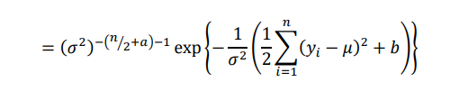

<style>
body {
text-align: justify}
</style>
```{r setup, include=FALSE}
knitr::opts_chunk$set(message = FALSE)
knitr::opts_chunk$set(warning = FALSE)
```

**Catatan : Kodingan ini untuk memenuhi tugas simdat, kemungkinan banyak kesalahan. Mohon dimaklumi**

# Gibbs Sampler

## Contoh Gibbs Sampler (1)

Diketahui pengamatan 	$x_{1}, x_{2}, \dots, x_{n}$, mengikuti model eksponensial $p(x|a,b)= ab \ esp(-abx); x>0;a,b>0$ dengan prior:

\begin{align*}
p(a,b)= exp(-a -b); a,b>0
\end{align*}

Estimasi parameter $a$ dan $b$
Catatan: data dibangkitkan dengan perintah
```{r}
set.seed(123)
data <- rexp(100,4*5)
```

Jawab:
Likelihood dari model eksponensial tersebut adalah


dan priornya adalah

\begin{align*}
p(a,b) & = exp(-a -b)\\
& = exp(-a)exp(-b)
\end{align*}

Posteriornya:


Full Conditional posterior distribution parameter $a$ adalah:


Ini berarti bahwa full conditional posterior distribution $a$ adalah $Gamma(n+1,(1+b\sum_{i=1}^n x_i))$

Untuk Full conditional posterior distribution parameter $b$ adalah:


Ini berarti bahwa full conditional posterior distribution $b$ adalah $Gamma(n+1,(1+a\sum_{i=1}^n x_i))$


Rcode:
```{r}
sampleGibbs <- function(start.a, start.b, n.sims, data){
  # get sum, which is sufficient statistic
  sumx <- sum(data)
  # get n
  n <- nrow(data)
  # create empty matrix, allocate memory for efficiency
  res <- matrix(NA, nrow = n.sims, ncol = 2)
  res[1,] <- c(start.a,start.b)
  for (i in 2:n.sims){
    # sample the values
    res[i,1] <- rgamma(1, shape = n+1, rate = res[i-1,2]*sumx+1)
    res[i,2] <- rgamma(1, shape = n+1, rate = res[i,1]*sumx+1)
  }
  return(res)
}
```

### Menjalankan Gibbs Sampler
```{r}
library(coda)
n.sims <- 100000
# return the result (res)
data<-as.matrix(data)
theta <- sampleGibbs(4,4,n.sims,data) #start a dan b bebas
thetac2<-as.mcmc(theta)
summary(thetac2)
plot(thetac2)
```

### Interpretasi

Salah satu cara melihat konvergen atau tidak bisa dilihat dari plotnya, jika garis densitynya mulus, dia bisa dibilang konvergen, jika masih bergerigi atau ada lonjakan, bisa ditambah iterasinya. Kemudian bisa juga dilihat dari tracenya, jika berbentuk seperti ulat gemuk, bisa dibilang konvergen.

### Uji Geweke
```{r}
geweke.diag(thetac2)
```
### Interpretasi Geweke

Jika kita menggunakan Uji Geweke, hasilnya jika dilihat dari Z-score (dengan tingkat signifikansi 5%), var1 dan var2 berada diantara -1.96 dan 1.96 artinya Gagal tolak H0, konvergen.

### Uji Raftery
```{r}
raftery.diag(thetac2)
```

### Interpretasi Raftery

Hasil dari uji Raftery: Total iterasi yang dibutuhkan adalah keduanya sebanyak 41 ribu dan 35 ribu, sedangkan iterasi yang kita gunakan sebanyak 100000. Ini berarti iterasi sudah bisa dikatakan cukup. Kemudian nilai I cukup besar yang berarti variabel dependen (autokorelasi). Dikatakan independen jika nilai I mendekati 1.

### Uji Heidel
```{r}
heidel.diag(thetac2)
```

### Interpretasi Uji Heidel

Untuk uji Heidel menghasilkan passed, yang berarti dapat dikatakan stasioner.


### Uji Gelman

Uji Gelman dibutuhkan dua chain, maka dibuituhkan 1 chain lagi
```{r}
library(coda)
set.seed(12)
thetac3 <- as.mcmc(sampleGibbs(3, 3, 100000, data))
```

```{r}
thetac <- list(thetac2, thetac3)
gelman.diag(thetac)
```
### Interpretasi Uji Gelman

Untuk uji Gelman hasilnya bisa dikatakan konvergen karena nilai Upper C.Inya = 1.


## Contoh Gibbs Sampler (2)


Diketahui
\begin{align*}
X_i & \sim {\sf Normal}(\theta,\sigma^2), i = 1,\dots,n \\
\theta & \sim {\sf Normal} (\theta_0,\tau^2), \\
\sigma^2 & \sim {\sf IG} (a,b) \\
\end{align*}

Catatan: IG adalah Invers Gamma. Jika $\sigma^2$ berdistribusi Invers Gamma, berarti $1/\sigma^2$ berdistribusi gamma.
Estimasi parameter $\theta$ dan $\sigma$.

$a,b,\theta_0,\tau$ adalah hiperparameter yang nilainya ditentukan
Kita pakai:


$\theta_0=0$
$\tau^2=1/10^{-6}=10^6$
$a,b=10^-3$

Jawab:
Likelihood:
\begin{align*}
p(x|\theta,\sigma^2) & = \prod_{i = 1}^{n} \frac{1}{\sqrt{2\pi\sigma^2}} exp( \frac{-(x_i-\theta)^2}{2\sigma^2}) \\
& = (2\pi \sigma^2)^{-n/2} exp(-1/{2\sigma^2}\sum_{i=1}^{n} (x_i-\theta)^2)
\end{align*}

Prior:
\begin{align*}
p(\theta,\sigma^2)=\frac{1}{\sqrt{2\pi\tau^2}}exp(\frac{-(\theta-\theta_0)^2}{2\tau^2}) \ b^2/{\Gamma(a)}(\sigma^2)^{-a-1}exp(-b/\sigma^2)
\end{align*}


Full Conditional posterior distribution parameter $\theta$ adalah:


Ini berarti bahwa full conditional posterior distribution $\theta$ adalah $N(\frac{\tau^2\sum x_i +\theta_0\sigma^2}{n\tau^2+\sigma^2},\frac{\sigma^2\tau^2}{n\tau^2+\sigma^2})$

Full Conditional posterior distribution parameter $\sigma$ adalah:


Ini berarti bahwa full conditional posterior distribution $\sigma$ adalah

$IG(\frac{n}{2}+a,\frac{1}{2} \sum(x_i-\theta)^2+b)$

```{r}
sampleGibbs <- function(start.a, start.b, n.sims, data){
  # get sum, which is sufficient statistic
  sumx <- sum(data)
  # get n
  n <- nrow(data)
  # create empty matrix, allocate memory for efficiency
  res <- matrix(NA, nrow = n.sims, ncol = 2)
  res[1,] <- c(start.a,start.b)
  for (i in 2:n.sims){
    # sample the values
    mu <- 10^(6)*sumx/(n*10^6 + res[i-1, 2]^2)
    sd <- sqrt(res[i-1, 2]^2*10^6/(n*10^6 + res[i-1, 2]^2))
    res[i,1] <- rnorm(1, mu, sd)
    a <- n/2 + 10^(-3)
    b <- sum((data - res[i, 1])^2)/2 + 10^(-3)
    res[i,2] <- sqrt(rinvgamma(1, a, b))
  }
  return(res)
}
```

```{r}
library(invgamma)
set.seed(123)
data <- rnorm(150, 7, 16)
n.sims <- 25000
# return the result (res)
data <- as.matrix(data)
thetag1 <- sampleGibbs(2, 10, n.sims, data)
thetag1 <-as.mcmc(thetag1)
summary(thetag1)
plot(thetag1)
```
Dilihat dari plotnya sudah bisa dikatakan konvergen. Kemudian untuk rata-rata estimasi theta, yaitu 6.603 dan sigma 15.268. Aslinya theta sebesar 7 dan sigmanya sebesar 16.

Kemudian 95% nilai theta ada diantara 4.179 sampai 9.05, sedangkan sigma diantara 13.642 sampai 17.13.

### Uji Geweke
```{r}
geweke.diag(thetag1)
```

Dari hasil diatas membuktikan bahwa kedua variabel ini konvergen karena nilainya diantara -1.96 sampai 1.96.


### Uji Raftery
```{r}
raftery.diag(thetag1)
```

Dari hasil tersebut iterasi yang dilakukan sudah cukup dan Variabel bisa dikatakan independen karena mendekati nilai 1.


### Uji Heidel
```{r}
heidel.diag(thetag1)
```

Dari uji Haidel ini semuanya sudah passed yang artinya sampelnya stasioner.


### Uji Gelman
```{r}
thetag2 <- as.mcmc(sampleGibbs(2.5, 11, 25000, data))

thetag <- list(thetag1, thetag2)

gelman.diag(thetag)
```

Dari hasil uji Gelman nilai upper C.I-nya adalah 1 yang berarti konvergen.


## Contoh Gibbs Sampler (3)


Misalkan data di atas berdistribusi Normal, $y \sim N(\mu,\sigma^2)$. $\mu$ dan $\sigma^2$ diestimasi menggunakan metode Bayesian dengan ditentukan priornya adalah $\mu \sim Normal(m,s^2)$ dan $\sigma^{-2} = \tau \sim Gamma(a,b)$. Estimasi $\mu$ dan $\sigma^2$


Jawab:

Likelihood:

\begin{align*}
p(\mathbf{y}|\mu,\sigma^2) & = \prod_{i=1}^n p(y_i|\mu,\sigma^2) \\
& = (2\mu\sigma^2)^{-\frac{n}{2}}exp(-\frac{1}{2\sigma^2}\sum_{i=1}^n (y_i-\mu)^2)
\end{align*}

$\sigma^{-2} = \tau \sim Gamma(a,b)$, prior dari modelnya adalah:

$p(\mu,\sigma^2)=\frac{1}{\sqrt{2\pi s^2}} exp(-\frac{(\mu-m)^2}{2s^2})\frac{b^a}{\Gamma(a)}(\sigma^2)^{-a-1}exp(-\frac{b}{\sigma^2})$

Prior yang diberikan tidak informatif, maka kita pakai:

$\mu \sim N(0,10^6)$
$\sigma^2\sim Inv Gamma(10^{-3},10^{-3})$

Posterior dari model tersebut:


Full conditional posterior untuk $\mu$:


Full conditionalnya:
$\mu | \sigma^2,\mathbf{y}\sim N(\frac{s^2\sum y_i+m\sigma^2}{ns^2+\sigma^2},\frac{s^2\sigma^2}{ns^2+\sigma^2})$


Full conditional posterior untuk $\sigma^2$:




Full conitionalnya:
$\sigma^2 | \mu, \mathbf y \sim Inv Gamma(\frac{n}{2}+a,\frac{1}{2}\sum_{i=1}^n (y_i-\mu)^2+b)$

```{r}
sampleGibbs <- function(mu, sig2, n.sims, data){
  # get sum, which is sufficient statistic
  sumx <- sum(data)
  # get n
  n <- nrow(data)
  # create empty matrix, allocate memory for efficiency
  res <- matrix(NA, nrow = n.sims, ncol = 2, dimnames = list(c(),c("mu", "sig2")))
  res[1,] <- c(mu,sig2)
  for (i in 2:n.sims){
    # sample the values
    mu <- 10^(6)*sumx/(n*10^6 + res[i-1, 2]^2)
    sd <- sqrt(res[i-1, 2]^2*10^6/(n*10^6 + res[i-1, 2]^2))
    res[i,1] <- rnorm(1, mu, sd)
    a <- n/2 + 10^(-3)
    b <- sum((data - res[i, 1])^2)/2 + 10^(-3)
    res[i,2] <- sqrt(rinvgamma(1, a, b))
  }
  return(res)
}
```


```{r}
data<-read.csv2("data/quiz.csv")
data<-data[,2]
n.sims <- 25000
# return the result (res)
data <- as.matrix(data)
thetag1 <- sampleGibbs(0, 1, n.sims, data)
thetag1 <-as.mcmc(thetag1)
summary(thetag1)
plot(thetag1)
```
Dilihat dari plotnya sudah bisa dikatakan konvergen. Kemudian untuk rata-rata estimasi mu, yaitu 1.014 dan sigma2 1.059.

Kemudian 95% nilai mu ada diantara 0.7428 sampai 1.285, sedangkan sigma2 diantara 0.8869 sampai 1.274.


### Uji Geweke

```{r}
geweke.diag(thetag1)
```

Dari hasil diatas membuktikan bahwa kedua variabel ini konvergen karena nilainya diantara -1.96 sampai 1.96.


### Uji Raftery

```{r}
raftery.diag(thetag1)
```

Dari hasil tersebut iterasi yang dilakukan sudah cukup dan Variabel bisa dikatakan independen karena mendekati nilai 1.


### Uji Heidel

```{r}
heidel.diag(thetag1)
```

Dari uji Haidel ini semuanya sudah passed yang artinya sampelnya stasioner.