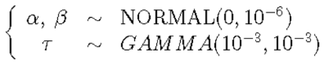
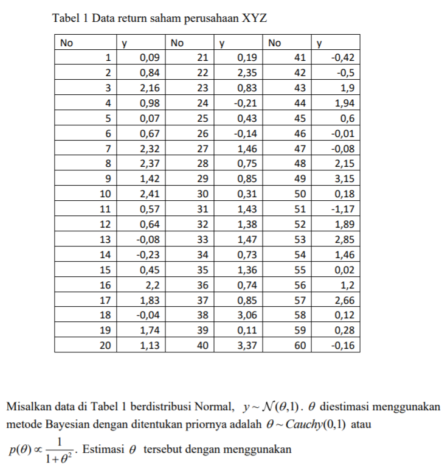
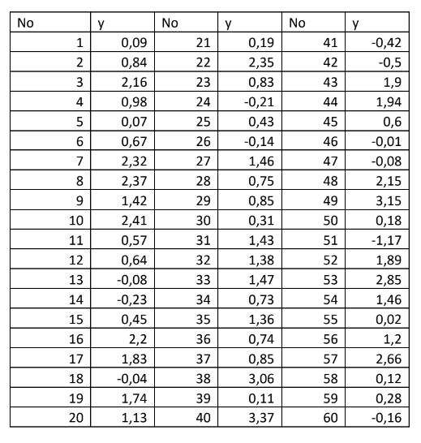

<style>
body {
text-align: justify}
</style>
```{r setup, include=FALSE}
knitr::opts_chunk$set(message = FALSE)
knitr::opts_chunk$set(warning = FALSE)
```

**Catatan : Kodingan ini untuk memenuhi tugas simdat, kemungkinan banyak kesalahan. Mohon dimaklumi**

# BUGS

## Contoh BUGS (1)

Diketahui pengamatan 	$x_{1}, x_{2}, \dots, x_{n}$, mengikuti model eksponensial $p(x|a,b)= ab \ esp(-abx); x>0;a,b>0$ dengan prior:

\begin{align*}
p(a,b)= exp(-a -b); a,b>0
\end{align*}

Estimasi parameter $a$ dan $b$
Catatan: data dibangkitkan dengan perintah
```{r}
set.seed(123)
data <- rexp(100,4*5)
```

Jawab:

```{r}
model<-"model
    {for (i in 1:n)
      {y[i]~dexp(a*b)
    }
a~dexp(1)
b~dexp(1)
}"
```

```{r}
library(runjags)
n<-length(data)
y<-list(y=as.vector(data),n=n)

inits<-list(list(a=2,b=2),
            list(a=3,b=3))

results <- run.jags(model=model, monitor=c("a", "b"),
                    data=y, n.chains=2, method="rjags", inits=inits)
```

```{r}
summary(results)
```

```{r}
library(coda)
mcresult<-as.mcmc(results)
plot(mcresult)
```

## Contoh BUGS (2)


Diketahui
\begin{align*}
X_i & \sim {\sf Normal}(\theta,\sigma^2), i = 1,\dots,n \\
\theta & \sim {\sf Normal} (\theta_0,\tau^2), \\
\sigma^2 & \sim {\sf IG} (a,b) \\
\end{align*}

Catatan: IG adalah Invers Gamma. Jika $\sigma^2$ berdistribusi Invers Gamma, berarti $1/\sigma^2$ berdistribusi gamma.
Estimasi parameter $\theta$ dan $\sigma$.

$a,b,\theta_0,\tau$ adalah hiperparameter yang nilainya ditentukan
Kita pakai:



$\theta_0=0$
$\tau^2=1/10^{-6}=10^6$
$a,b=10^-3$

Jawab:

```{r}
model<-"model
	{for (i in 1:n)
{y[i]~dnorm(mu, tau)
}
tau~dgamma(1.0E-3,1.0E-3)
mu ~ dnorm(0, 1.0E-6)
sigma <- 1/sqrt(tau)
}"
```

```{r}
library(runjags)
set.seed(123)
data <- rnorm(150, 7, 16)
n<-length(data)
y<-list(y=as.vector(data),n=n)

inits<-list(list(mu = 25, tau = 10),
            list(mu = 30, tau = 11))
results <- run.jags(model=model, monitor=c("mu", "sigma"), 
                    data=y, n.chains=2, method="rjags", inits=inits)
summary(results) 
thetab1 <- as.mcmc(results)

summary(thetab1)

plot(thetab1)
```

Kita gunakan nilai inisialisasi yang sangat jauh dari nilai parameter aslinya ternyata dihasilkan sebagai berikut:
Rata-rata parameter mu(theta) adalah 6.609 dan sigma 15.276, tidak jauh dari nilai aslinya, yaitu 7 dan 16.

Kemudian kita yakini 95% bahwa nilai mu(theta) antara 4.204 sampai 9.083 dan nilai sigma antara 13.647 sampai 17.146.

Kemudian jika kita lihat dari plot tracenya sudah seperti ulat bulu gemuk yang berarti bisa diasumsikan konvergen.

### Uji Geweke

```{r}
geweke.diag(thetab1)
```

Berdasarkan dari uji Geweke, nilai Z dari kedua variabel tersebut ada diantara -1.96 sampai 1.96 yang berarti konvergen.


### Uji Raftery

```{r}
raftery.diag(thetab1)
```

Dari hasil uji Raftery, iterasi yang dilakukan sudah cukup karena minimal diperlukan sebanyak 3 ribuan iterasi dan ternyata nilai I-nya mendekati 1 yang berarti independen.


### Uji Heidel

```{r}
heidel.diag(thetab1)
```

Untuk uji Heidel didapatkan semuanya passed yang berarti stasioner.


### Uji Gelman

```{r}
gelman.diag(results)
```

jika kita uji Gelman, hasil dari batas atasnya adalah 1 yang berarti sudah stasioner.


## Contoh BUGS (3)



catatan: Distribusi Cauchy sama dengan distribusi Student t dengan derajat bebasnya adalah 1.

Jawab:

```{r}
model1 <- "model{
 for (i in 1:n){
 y[i] ~ dnorm(theta, 1)
 }
 theta ~ dt(0, 1, 1)
}"
```

### Menjalankan Code
```{r}
library(runjags)
data<-read.csv2("data/quiz.csv")
data<-data[,2]
n <- length(data)
y <- list(y = as.vector(data), n = n)
inits <- list(list(theta = 0),
              list(theta = 0.5))
thetabb <- run.jags(model = model1, monitor = c("theta"), 
                    data = y, n.chains = 2, method = "rjags", inits = inits
)
```


```{r}
thetabmcb <- as.mcmc(thetabb)
plot(thetabmcb)

```

Jika dilihat dari plotnya, sudah bisa dikatakan bahwa sudah konvergen.


### Uji Geweke

```{r}
geweke.diag(thetabmcb)
```

Berdasarkan dari uji Geweke, nilai Z dari kedua variabel tersebut ada diantara -1.96 sampai 1.96 yang berarti konvergen.


### Uji Raftery

```{r}
raftery.diag(thetabmcb)
```

Dari hasil uji Raftery, nilai I-nya di sekitar 1 sampai 2 (kurang tau ya, ini masuknya independen atau dependen).


### Uji Heidel

```{r}
heidel.diag(thetabmcb)
```

Untuk uji Heidel didapatkan semuanya passed yang berarti stasioner.


### Uji Gelman

```{r}
gelman.diag(thetabb)
```

jika kita uji Gelman, hasil dari batas atasnya adalah 1 yang berarti sudah stasioner.


## Contoh BUGS (4)



Misalkan data di atas berdistribusi Normal, $y \sim N(\mu,\sigma^2)$. $\mu$ dan $\sigma^2$ diestimasi menggunakan metode Bayesian dengan ditentukan priornya adalah $\mu \sim Normal(m,s^2)$ dan $\sigma^{-2} = \tau \sim Gamma(a,b)$. Estimasi $\mu$ dan $\sigma^2$

Jawab:
```{r}
model2 <- "model{
 for (i in 1:n){
 y[i] ~ dnorm(mu, tau)
 }
 mu ~ dnorm(0, 1.0E-6)
 tau ~ dgamma(1.0E-3, 1.0E-3)
 sig2 <- 1/tau
}"

library(runjags)
n <- length(data)
y <- list(y = as.vector(data), n = n)
inits <- list(list(mu = 0, tau = 1),
              list(mu = 0.5, tau = 1.1))

thetab2 <- run.jags(model = model2, monitor = c("mu", "sig2"), 
                    data = y, n.chains = 2, method = "rjags", inits = inits
)
```

```{r}
thetabmcb2 <- as.mcmc(thetab2)
plot(thetabmcb2)

```

Jika dilihat dari plotnya, sudah bisa dikatakan bahwa sudah konvergen.


### Uji Geweke

```{r}
geweke.diag(thetabmcb2)
```

Berdasarkan dari uji Geweke, nilai Z dari kedua variabel tersebut ada diantara -1.96 sampai 1.96 yang berarti konvergen.


### Uji Raftery

```{r}
raftery.diag(thetabmcb2)
```

Dari hasil uji Raftery, nilai I-nya mendekati 1, dapat dikatakan variabelnya independen.


### Uji Heidel

```{r}
heidel.diag(thetabmcb2)
```

Untuk uji Heidel didapatkan semuanya passed yang berarti stasioner.


### Uji Gelman

```{r}
gelman.diag(thetab2)
```

jika kita uji Gelman, hasil dari batas atasnya adalah 1 yang berarti sudah stasioner.
